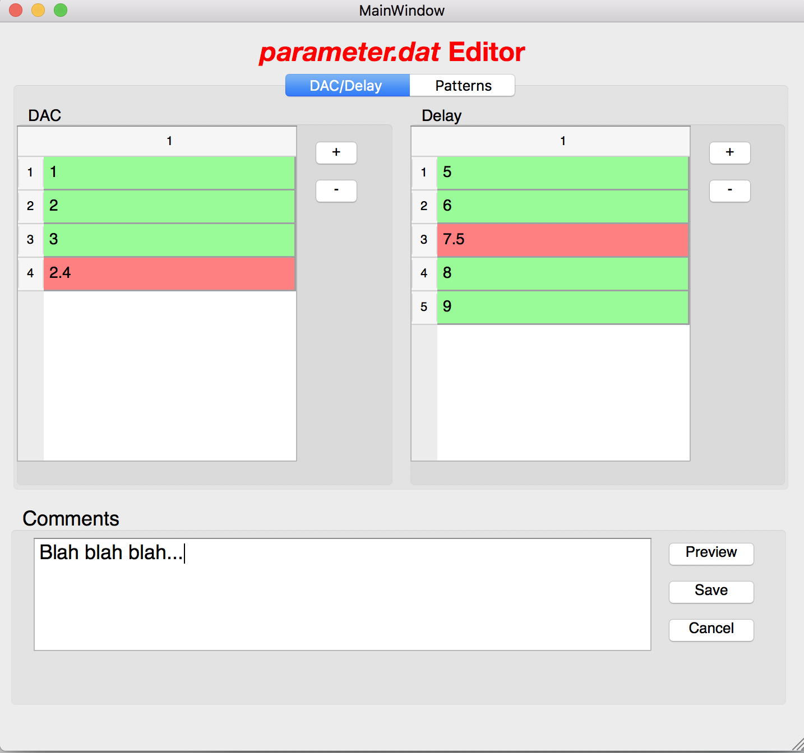
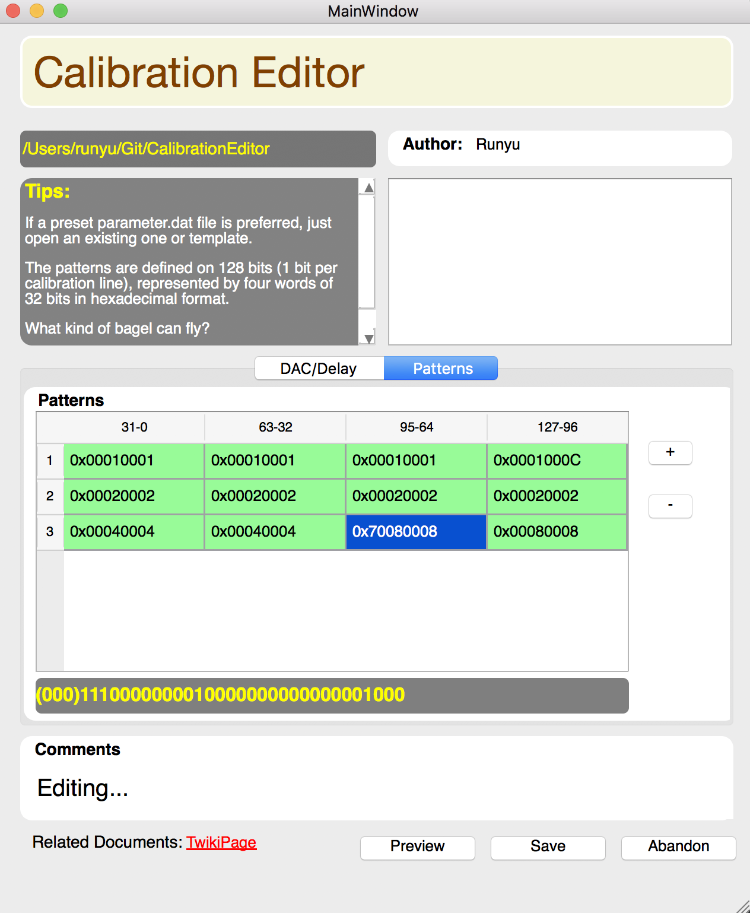

## Purpose :monkey_face:

**CalibrationEditor** is a user-friendly program dedicated at generating proper, 
informative parameter.dat files. The current decision for the residence of the program 
will be under the __LAr/SuperExpert__ Tab inside the calibration panel.

## Dependecies:
PyQt >= 4

## Current State:
**Verison 1**: rolled out as file **EditorV1.py**
### User Interface:

### Update 6/28:

**Verison 2**: rolled out as file **EditorV2.py**
* User Interface entirely **Revamped!**
* **"Open" feature** is now supported.
* **"Save"** feature is now more robust.
* **Added** "Author:" to record the editor's name while saving.
* **Added** "Tips" as a reminder for the meanings of all the values (What other info should we put into it?)
* **Added** "Hexadecimal # to Binary" converter: will convert when double clicking a cell in "Pattern Table".
* **Moved** "Comment" to the top when previewing and saving.
* **Added** a link to direct the editor to the original **Twiki page**.
* Added a display to show pwd info.
* * Left a blank area for future discussion (cool pictures/logos maybe?)

